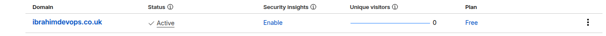
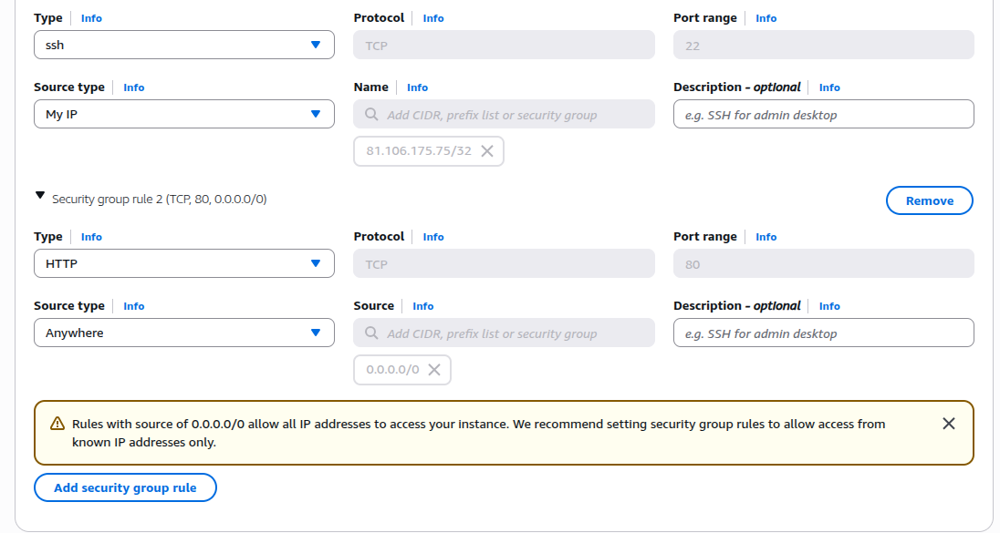
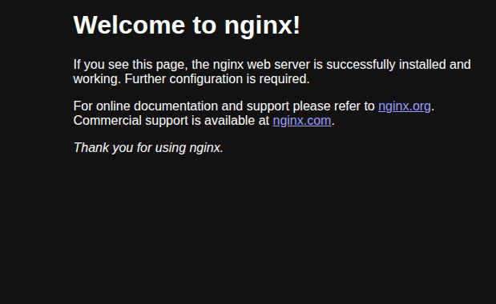
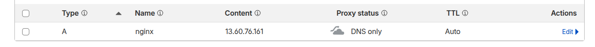
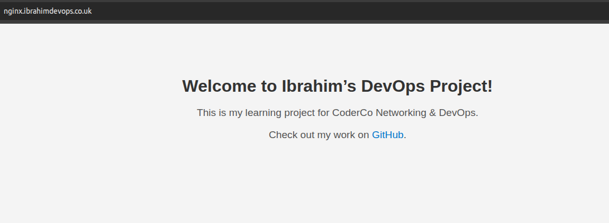

# EC2 NGINX Server Assignment

- This guide demonstrates how I deployed an **NGINX web server** on an **AWS EC2 instance** and connected it to my personal domain

---

## ⚙️ Setup steps:

## Step 1: Domain setup

- Purchase a personal domain from either AWS Route 53 or Cloudflare (I chose the latter)

- 

---

## Step 2: Launch EC2 Instance

- Go to the AWS EC2 dashboard and click "Launch Instance"
- Choose an AMI - I selected **Ubuntu 20.04 LTS**
- Select the instance type (eg: t2.micro for free tier)
- Optional to add tags but add name
- Configure Security group
    - **SSH (22)** - Connects to the server
    - **HTTP (80)** - Allows web browsers to view the NGINX webpage. Without this, our domain and public IP will timeout or refuse to connect

- 

---

## Step 3: Connect to the server using ssh in your terminal

- `ssh -i /path/to/key.pem ubuntu@PUBLIC_IP`

---

## Step 4: Install & Run NGINX

- `sudo apt install nginx -y`
- `sudo apt systemctl start nginx`
- `sudo systemctl enable nginx` - This ensures it runs on reboot if the EC2 instanc restarts keeping the webpage online
- `systemctl status nginx` - Check to see if it is running. Should see **active (running**)

---

## Step 5: Test in browser

- You should see the NGINX default welcome page

- 

---

## Step 6: Connect Domain to EC2

- Create an **A record** in Cloudflare pointing `nginx.ibrahimdevops.co.uk` -> EC2 public IPv4

- 

---

## (Optional Step): Customize website

- `sudo vim /var/www/html/index.nginx-debian.html`

- 

---

## Outcome

- EC2 instance running NGINX is publicly accessible via the domain: `nginx.ibrahim.devops.co.uk`
- Demonstrates cloud deployment, server setup, and domain routing skills